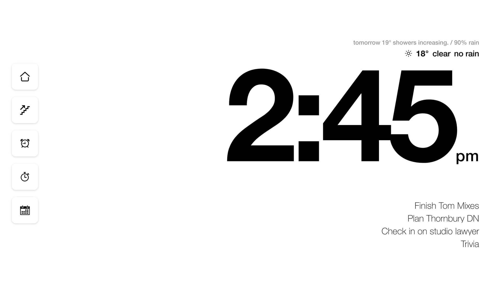

# e-waste wallclock

### A way to reuse old iPads/tablets as a wall dash or clock, first built for an old 11" iPad, salvaged from e-waste. 



## Features & Integrations

- **Home Assistant**  - integration for button shortcuts (replace icons in `/buttons` as desired)
- **Notion** -  database integration (one for cal, one for tasks, see below for config)
- **Weather** -  from BoM (Australia)
- **Alarm/Timer** - quick alarm / timer with custom audio & graphic overlay

- **Vibes** - Subtle golden-sun bg gradient fades in/out with time, just looks nice cmon look at it


## Quick start

```sh
npm install
cp .env.example .env
# fill in NOTION_TOKEN + NOTION_DATABASE_ID + NOTION_WORK_ID
npm start
```

Open `http://<server-ip>:3000` on the iPad. Share → **Add to Home Screen**. Launching from that icon runs fullscreen (no Safari chrome).


## Notion

#### There are two databases configured - one displays the tasks below the clock, the other displays events in the calendar modal. 

### Database - To Do
- This the main database set by `NOTION_DATABASE_ID` and appears under the clock
- I use a `by` column for Dates, this is for **Slack** automations  that remind me on a cadance set by the `freq` column
  - i.e: the task 'Finish Tom Mixes' has a by date of 9 June; if it still exists in that db by the date, it will remind me based on the frequency set by `Freq` (see `server.js` for more info on that)
### Database - Work
- This database displays events based on the date column in the `NOTION_WORK_ID` database.
  - This does not need to be a 'work' database per say, it was just built out to be my work calendar
* This will display events for the day only in the modal when opened via the calendar button.

### How to setup Notion

1. Go to https://www.notion.so/profile/integrations → **+ New integration** → internal. Copy the secret into `NOTION_TOKEN`.
2. Open the todo database in Notion → `…` → **Connections** → add your integration.
3. Copy the DB ID from the URL: `notion.so/<workspace>/<32-hex-id>?v=…` → the 32-hex chunk is `NOTION_DATABASE_ID`.
4. The server reads the page's title property automatically. If your DB has a `Done` or `Complete` checkbox, those items are hidden.
5. Add a separate work/calendar database ID as `NOTION_WORK_ID`. Share that database with the same integration. The calendar modal reads only items dated today from this database.


## Weather (BoM)

Default set to BoM Melbourne, no key required:
- Observations: `IDV60901.95936` (Melbourne Olympic Park)
- Forecast: `IDV10450.xml` (VIC precis, Melbourne area)


Change via https://www.bom.gov.au/catalogue/data-feeds.shtml

Cached 10 min server-side; served stale on upstream failure.
Error / logging may say Melbourne even when changed.


## Auto-start the server

### macOS (launchd)

Save as `~/Library/LaunchAgents/com.local.ipad-dashboard.plist`:

```xml
<?xml version="1.0" encoding="UTF-8"?>
<!DOCTYPE plist PUBLIC "-//Apple//DTD PLIST 1.0//EN" "http://www.apple.com/DTDs/PropertyList-1.0.dtd">
<plist version="1.0">
<dict>
  <key>Label</key><string>com.local.ipad-dashboard</string>
  <key>WorkingDirectory</key><string>/Users/you/git/ipad</string>
  <key>ProgramArguments</key>
  <array>
    <string>/usr/local/bin/node</string>
    <string>server.js</string>
  </array>
  <key>RunAtLoad</key><true/>
  <key>KeepAlive</key><true/>
  <key>StandardOutPath</key><string>/tmp/ipad-dashboard.log</string>
  <key>StandardErrorPath</key><string>/tmp/ipad-dashboard.err.log</string>
</dict>
</plist>
```

Then: `launchctl load ~/Library/LaunchAgents/com.local.ipad-dashboard.plist`

### Linux (systemd)

```ini
[Unit]
Description=iPad Dashboard
After=network.target

[Service]
WorkingDirectory=/home/you/git/ipad
ExecStart=/usr/bin/node server.js
Restart=always
EnvironmentFile=/home/you/git/ipad/.env

[Install]
WantedBy=multi-user.target
```

## Alarm tone

Drop any short MP3 at `public/alarm.mp3`. First tap on the dashboard unlocks iOS Safari audio for the session.

## Layout notes

Targeted at 1194×834 (iPad 11" landscape). Grid is fluid — desktop browsers render fine at similar ratios.

## Notion calendar

The calendar button opens the modal and loads today's items from the Notion database configured as `NOTION_WORK_ID`.

Add to `.env`:

```sh
NOTION_TOKEN=your-notion-integration-secret
NOTION_DATABASE_ID=your-task-database-id
NOTION_WORK_ID=your-notion-database2-id
```

The work database needs at least one date property. The server prefers date-like property names such as `Date`, `Day`, `When`, `Time`, `Calendar`, or `Start`, then falls back to the first date property it finds. Items are filtered to the current Melbourne day. Date-only items appear as all-day rows; items with times appear with their start/end times.
